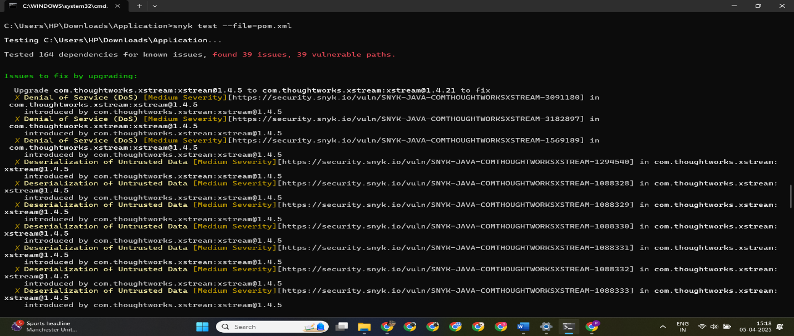
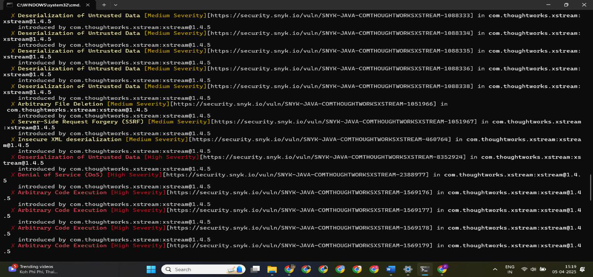
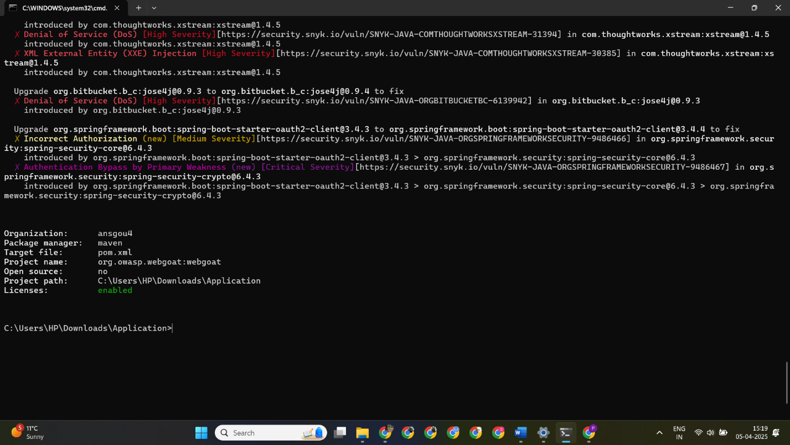

# 🔐 SAST & DAST Security Assessment — OWASP WebGoat


> **Module:** Cybersecurity for Software Development (B9CY104) | Dublin Business School  
> Combined SAST and DAST security assessment of OWASP WebGoat — identifying 10 high-severity SAST findings and 6 high-severity DAST findings, with full threat modelling using STRIDE methodology.

---

## 📌 Overview

This project is a comprehensive security assessment of **OWASP WebGoat** — a deliberately vulnerable web application used for security training — using both **Static Application Security Testing (SAST)** and **Dynamic Application Security Testing (DAST)** approaches.

The dual-tool methodology proved critical: SAST and DAST identified almost entirely different vulnerability sets, demonstrating why both approaches are necessary for complete security coverage.

| Phase | Tool | Vulnerabilities Found |
|-------|------|----------------------|
| SAST | Snyk (scanning `pom.xml`) | 10 high-severity findings |
| DAST | OWASP ZAP (live application) | 6 high-severity findings |
| **Total** | | **16 high-severity vulnerabilities** |

---

## 🎯 Objectives

- Identify vulnerabilities in source code and dependencies using SAST before deployment
- Discover runtime and exploitable vulnerabilities using DAST against a live application
- Compare and contrast SAST vs DAST tools in terms of coverage, accuracy, and false positive rates
- Apply STRIDE threat modelling to prioritise the top 5 vulnerabilities
- Evaluate secure coding vs patching as security strategies

---

## 🛠️ Tools Used

| Tool | Type | Purpose |
|------|------|---------|
| **Snyk** | SAST | Scanned `pom.xml` for vulnerable dependencies |
| **OWASP ZAP** | DAST | Active and passive scanning of running WebGoat instance |
| **Docker** | Infrastructure | Containerised WebGoat deployment |
| **OWASP SKF** | Reference | Secure code snippet guidance for remediation |

---

## 🚨 SAST Findings — Snyk (10 High-Severity Vulnerabilities)

All vulnerabilities were found in outdated dependencies via `pom.xml` scan.

| # | Vulnerability | Affected Library | CWE |
|---|--------------|-----------------|-----|
| 1 | Arbitrary Code Execution | `com.thoughtworks.xstream:xstream` | CWE-502 |
| 2 | XML External Entity (XXE) Injection | `com.thoughtworks.xstream:xstream` | CWE-611 |
| 3 | Denial of Service (DoS) | `org.bitbucket.b.c:jose4j` | CWE-400 |
| 4 | Insecure XML Deserialization | `com.thoughtworks.xstream:xstream` | CWE-502 |
| 5 | Remote Code Execution | `org.springframework.security:spring-security-core` | CWE-94 |
| 6 | Path Traversal | `com.thoughtworks.xstream:xstream` | CWE-22 |
| 7 | Remote Code Execution (2nd vector) | `com.thoughtworks.xstream:xstream` | CWE-94 |
| 8 | Authentication Bypass | `org.springframework.security:spring-security-core` | CWE-287 |
| 9 | Cryptographic Weakness | `org.springframework.security:spring-security-crypto` | CWE-327 |
| 10 | Command Injection | `com.thoughtworks.xstream:xstream` | CWE-78 |

---

### SAST Finding Details

#### 1. Arbitrary Code Execution in XStream (CWE-502)
The application uses an outdated XStream library that allows arbitrary code execution when deserialising untrusted XML input.

```xml
<!-- VULNERABLE — outdated XStream in pom.xml -->
<dependency>
    <groupId>com.thoughtworks.xstream</groupId>
    <artifactId>xstream</artifactId>
    <version>1.4.17</version>  <!-- vulnerable -->
</dependency>

<!-- FIXED — update to latest patched version -->
<dependency>
    <groupId>com.thoughtworks.xstream</groupId>
    <artifactId>xstream</artifactId>
    <version>1.4.20</version>
</dependency>
```
**Impact:** Complete server compromise, data theft, malware installation, lateral movement.

---

#### 2. XML External Entity (XXE) Injection (CWE-611)
XML parsers processing external entity references, allowing attackers to read arbitrary server files or perform SSRF.

```java
// VULNERABLE — external entities enabled
DocumentBuilderFactory dbf = DocumentBuilderFactory.newInstance();
DocumentBuilder db = dbf.newDocumentBuilder();

// FIXED — disable external entity processing
DocumentBuilderFactory dbf = DocumentBuilderFactory.newInstance();
dbf.setFeature("http://apache.org/xml/features/disallow-doctype-decl", true);
dbf.setFeature("http://xml.org/sax/features/external-general-entities", false);
dbf.setFeature("http://xml.org/sax/features/external-parameter-entities", false);
DocumentBuilder db = dbf.newDocumentBuilder();
```
**Impact:** Sensitive file disclosure (e.g. `/etc/passwd`), SSRF, DoS through resource exhaustion.

---

#### 3. Authentication Bypass in Spring Security Core (CWE-287)
Vulnerable version of Spring Security Core could allow attackers to bypass authentication mechanisms by forging or manipulating authentication tokens.

```xml
<!-- VULNERABLE -->
<dependency>
    <groupId>org.springframework.security</groupId>
    <artifactId>spring-security-core</artifactId>
    <version>5.6.0</version>
</dependency>

<!-- FIXED -->
<dependency>
    <groupId>org.springframework.security</groupId>
    <artifactId>spring-security-core</artifactId>
    <version>5.8.8</version>
</dependency>
```

---

#### 4. Cryptographic Weakness (CWE-327)
Spring Security Crypto module using weak encryption algorithms or improper key management.

```java
// VULNERABLE — weak algorithm
String encrypted = weakEncrypt(sensitiveData, "DES");

// FIXED — use strong algorithm with proper key size
String encrypted = AesUtils.encrypt(sensitiveData, secureKey, "AES/GCM/NoPadding");
```

---

#### 5. Command Injection via XStream (CWE-78)
Crafted XML input processed by XStream can trigger execution of arbitrary OS commands.

```java
// VULNERABLE — user input reaches XStream deserialisation
XStream xstream = new XStream();
Object obj = xstream.fromXML(userInput);

// FIXED — configure XStream security
XStream xstream = new XStream();
XStream.setupDefaultSecurity(xstream);
xstream.allowTypesByWildcard(new String[]{"com.myapp.model.**"});
```

---

## 🔍 DAST Findings — OWASP ZAP (6 High-Severity Vulnerabilities)

| # | Vulnerability | Affected Endpoint | Severity |
|---|--------------|-------------------|----------|
| 1 | Vulnerable JS Library (underscore.js 1.10.2) | `/WebGoat/js/underscore-min.js` | 🟠 High |
| 2 | SQL Injection — Generic SQL/RDBMS | `/WebGoat/SqlInjection/login` | 🟠 High |
| 3 | SQL Injection — Hypersonic SQL | `/WebGoat/SqlInjection/assignment/a` | 🟠 High |
| 4 | SQL Injection — SQLite (Time-based Blind) | `/WebGoat/SqlInjection/attack3` | 🟠 High |
| 5 | Path Traversal | Multiple endpoints | 🟠 High |
| 6 | Cross-Site Scripting (Reflected XSS) | Multiple endpoints | 🟠 High |

---

### DAST Finding Details

#### 1. SQL Injection — Multiple Variants
Three distinct SQL injection vulnerabilities found across different endpoints and database backends.

```java
// VULNERABLE — string concatenation in SQL query
String query = "SELECT * FROM users WHERE username='" + username + "' AND password='" + password + "'";

// FIXED — parameterized queries
PreparedStatement stmt = conn.prepareStatement(
    "SELECT * FROM users WHERE username=? AND password=?"
);
stmt.setString(1, username);
stmt.setString(2, password);
```
**Attack vector:** Time-based blind injection using `randomblob()` confirmed database enumeration possible.

---

#### 2. Cross-Site Scripting — Reflected XSS
User input reflected in HTTP response without encoding, allowing script injection.

```java
// VULNERABLE — unencoded output
response.getWriter().println("<div>" + request.getParameter("search") + "</div>");

// FIXED — encode output
String safe = ESAPI.encoder().encodeForHTML(request.getParameter("search"));
response.getWriter().println("<div>" + safe + "</div>");
```

---

#### 3. Path Traversal
File path inputs accepted without validation, allowing directory traversal.

```java
// VULNERABLE
File file = new File(baseDir + request.getParameter("filename"));

// FIXED — canonicalize and validate
File file = new File(baseDir, request.getParameter("filename"));
String canonical = file.getCanonicalPath();
if (!canonical.startsWith(baseDir)) {
    throw new SecurityException("Path traversal attempt detected");
}
```

---

#### 4. Vulnerable JavaScript Library (CVE-2021-23358)
`underscore.js` version 1.10.2 running client-side — known template injection vulnerability.

```html
<!-- VULNERABLE -->
<script src="/WebGoat/js/underscore-min.js"></script>  <!-- v1.10.2 -->

<!-- FIXED — update to patched version + add SRI check -->
<script
  src="https://cdn.example.com/underscore-min.js"
  integrity="sha384-..."
  crossorigin="anonymous">
</script>
```

---

## 📊 SAST vs DAST Comparison

| Aspect | SAST (Snyk) | DAST (OWASP ZAP) |
|--------|-------------|------------------|
| When run | Before deployment (source code) | Against running application |
| What it finds | Dependency vulnerabilities, code-level flaws | Exploitable runtime vulnerabilities |
| False positive rate | Higher | Lower |
| Coverage | All code including unused paths | Only active, tested endpoints |
| Unique findings | XStream RCE, XXE, crypto weakness, auth bypass | SQL injection, XSS, path traversal, vulnerable JS |
| Overlap | Limited — tools found mostly different issues | Limited |
| Best for | Early development, CI/CD pipeline gates | Pre-release verification, runtime validation |

**Key insight:** There was minimal overlap between SAST and DAST findings — demonstrating that **both tools are essential** for complete security coverage. Neither alone would have caught all 16 vulnerabilities.

### Recommended Approach
- **Semgrep / Snyk** → pre-commit hooks and developer workflow (fast, targeted)
- **OWASP ZAP** → CI/CD pipeline and pre-release testing (runtime verification)

---

## 🎯 Threat Modelling — STRIDE

STRIDE methodology was applied to the top 5 vulnerabilities.

### STRIDE Threat Matrix

| Vulnerability | Spoofing | Tampering | Repudiation | Info Disclosure | DoS | Privilege Escalation |
|--------------|----------|-----------|-------------|-----------------|-----|----------------------|
| Arbitrary Code Execution (XStream) | | ✅ | | | | ✅ |
| SQL Injection | | ✅ | | ✅ | | ✅ |
| XXE Injection | | | | ✅ | ✅ | |
| Cross-Site Scripting | ✅ | ✅ | | ✅ | | |
| Path Traversal | | ✅ | | ✅ | | |

---

### Threat Prioritisation

| Priority | Vulnerability | Action Required |
|----------|--------------|-----------------|
| 🔴 Critical | Arbitrary Code Execution in XStream | Immediate — update XStream, implement class whitelist |
| 🔴 Critical | SQL Injection | Immediate — parameterized queries across all DB operations |
| 🟠 High | Cross-Site Scripting | Within 30 days — output encoding + CSP headers |
| 🟠 High | XXE Injection | Within 30 days — disable external entity processing |
| 🟠 High | Path Traversal | Within 60 days — canonicalize paths, restrict to web root |

---

## 🛡️ Secure Coding vs Patching

| Aspect | Secure Coding | Patching |
|--------|--------------|---------|
| Timing | Proactive — before deployment | Reactive — after vulnerability discovery |
| Scope | Comprehensive — addresses potential issues | Targeted — addresses known issues |
| Cost | Higher initial, lower long-term | Lower initial, higher cumulative |
| Code quality | Cleaner, more maintainable | Can introduce regression issues |
| Risk window | Minimal — no exposure period | Extended — vulnerability exists until patch applied |

**Conclusion:** Fixing security issues during development is up to **100x cheaper** than fixing after release (IBM Research). Secure coding from the start is more effective and cost-efficient than relying on patching.

---

## 📚 References

- OWASP (2023) — Top Ten: https://owasp.org/www-project-top-ten/
- OWASP (2023) — Security Knowledge Framework: https://www.securityknowledgeframework.org/
- Snyk Documentation (2023) — https://docs.snyk.io/
- OWASP ZAP Documentation (2023) — https://www.zaproxy.org/docs/
- OWASP (2023) — XSS Prevention Cheat Sheet
- OWASP (2023) — SQL Injection Prevention Cheat Sheet
- OWASP (2023) — XML External Entity Prevention Cheat Sheet
- MITRE (2023) — CWE-22: Path Traversal: https://cwe.mitre.org/data/definitions/22.html

---

## 👤 Author

**Anshio Renin Micheal Antony Xavier Soosammal**
MSc Cybersecurity | Dublin Business School | Student No: 20036753
Module: Cybersecurity for Software Development (B9CY104) | Lecturer: Tejas Bhat
🔗 [LinkedIn](https://linkedin.com/in/anshio-renin-ms) | CC ISC2 Certified | Open to Work in Ireland


## Screenshots

Selected screenshots captured during the assessment. The full walkthrough with every screenshot is in the report under `docs/`.








*The remaining 4 screenshots are in the `screenshots/` folder.*


---

